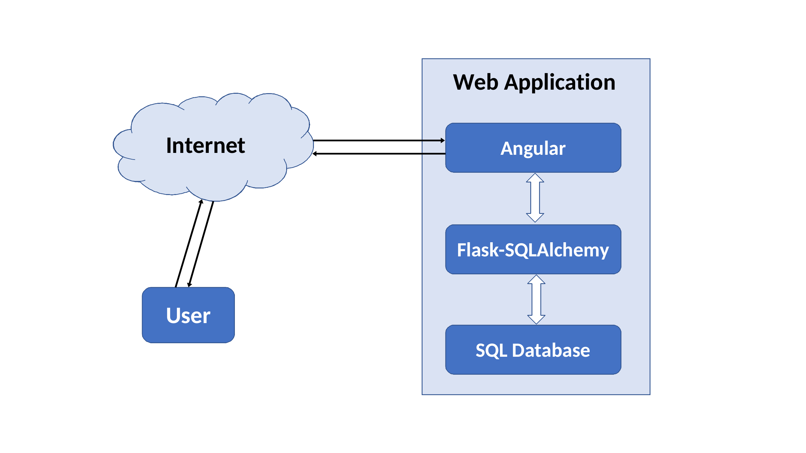

# CommuteTime App

## What is CommuteTime?
The CommuteTime App helps families in finding a location for their new home.  While time spent on commuting is a common priority, balancing daily commutes of two working adults is a non-trivial problem.  The CommuteTime App makes recommendations based on actual traffic data.


## Table of Contents
* [Demo](#demo)
* [Getting Started](#getting-started)
  * [Prerequisites](#prerequisites)
  * [Installing the Frontend](#installing-the-frontend)
  * [Installing the Backend](#installing-the-backend)
* [How does CommuteTime work?](#how-does-CommuteTime-work?)
  * [Optimization](#optimization)
  * [Architecture](#architecture)
* [Deployment](#deployment)
  * [Frontend](#deploying-the-frontend)
  * [Backend](#deploying-the-backend)
* [License](#license)

## Demo
For live demo, visit https://www.commutetime.app.

For demo video, click the image below.

[](https://youtu.be/KWbQADkYvqc)

## Getting Started
These instructions will get you a copy of the CommuteTime App running on your local machine.


### Prerequisites
* Angular
* npm package manager
* Python
* Google Maps API key


### Installing the Frontend
1. Open a terminal and enter the following command:

    ```bash
    npm install -g @angular/cli
    ng new frontend
    ```

1. Overwrite the folder `frontend/src` with content from this repository.

1. Launch the server:

    ```bash
    cd  frontend
    ng serve --open
    ```

### Installing the Backend
1. Provide your Google Maps API key in `backend/.env`.

1. Create a virtual environment and install the package requirements:

    ```bash
    cd backend
    pip install -r requirements.txt
    ```

1. Launch the API server:

    ```bash
    python waitress_server.py
    ```

Your copy of the CommuteTime App should be now running at http://localhost:4200.


# How does CommuteTime work?
The CommuteTime App makes recommendations based on actual traffic data.  The app assumes a workday from 8 am to 6 pm.  I have used the traffic on a Wednesday to represent the commute on a typical workday.


### Optimization
My first attempt at the problem was to minimize the total time spent on commuting.  The app made only one type of recommendation: live where one person works and make the other person have a long commute.  That isn't quite the intent.

Realizing the goal is to balance the commute time for both working adults, my next attempt was to equal commute times.  Because of granularity in the data, an extra parameter was introduced to allow for some difference in commute times.  Setting this parameter to around 30% resulted in reasonable recommendations, and this is the final implementation.


### Architecture



### Deployment


#### Deploying the Frontend
1. Provide your registered domain in `frontend/src/environments/environment.prod.ts`.

1. Insert your Google Analytics code in `frontend/src/index.html`

1. Build the angular package:
    ```bash
    ng build --prod
    ```

1. Upload the package to Amazon S3.

1. Configure Route 53 and CloudFront.


#### Deploying the Backend
1. Launch an Amazon EC2 instance with an Elastic IP.

1. Configure the ECC2 Security Group as follows:

    

1. Configure Route 53.

1. Provide your AWS EC2 login and domain name in `backend/.env`.

1. Run the setup script:
    ```bash
    cd backend
    ./setup.sh
## License
CommuteTime is under the MIT license.
